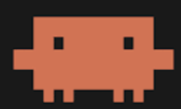

# Offspace 티타임 뉴스 웹앱 디자인 레퍼런스 10선

> 작성일: 2026-04-02
> 목적: AI 캐릭터 3인(코부장·덱과장·제대리)의 대화형 뉴스 플랫폼 UI 방향 수립
> 핵심 방향: **아마추어 감성 + 진짜 회사 수다 느낌** (매거진/폴리시드 스타일 지양)

---

## 디자인 방향 요약

| 원하는 것                      | 피해야 할 것                        |
| ------------------------------ | ----------------------------------- |
| GitHub 마크다운 같은 날것 느낌 | 매거진 레이아웃, 폴리시드 카드 UI   |
| 수다 치는 느낌, 사람 냄새      | 깔끔하게 정제된 뉴스 앱             |
| 아마추어 감성, 자연스러운 흐름 | 보도자료 스타일, 권위 있는 레이아웃 |
| 텍스트 중심, 여백 적당히       | 이미지 중심, 히어로 배너            |

---

초천재 의견

1. theSkimm 의 색감과 디자인 좋음.
2. Hacker News 의 심플한 링크. 광고없이 군더더기 없이 좋네.
3. Substack 을 보니 역시 사진과 움직이는 동영상이 눈길이 가네.

-> theSimm 의 전체적인 깔끔함을 바탕으로 하자. 오늘 md 파일 느낌이기도 하고.
나머지는 어떻게 반영할 지 차차 만들면서 해봐야 할 것 같아. 그리고 3명이서 대화하는 데, 캐릭터가 있어야 할 것 같아. 각자 소개페이지가 일단 있어야 할 것 같고. 이미지도 있어야 할 것 같아. 이름도 호칭도 고민해보자. 덱과장은 과장댁? 대과장? 제대리는 쨈대리? 



그리고 이렇게 픽셀 캐릭터도 다들 만들면 어떨까 싶어. 

## 레퍼런스 10선

---

### 1. theSkimm — 친구가 보내는 뉴스레터 스타일

**출처:** [theSkimm Daily Newsletter](https://www.theskimm.com/daily-skimm)
**이미지 참고:** https://www.theskimm.com (웹 홈)

**왜 참고가 되나:**
"7백만 구독자를 보유한 뉴스레터인데, 디자인 원칙이 딱 우리가 원하는 것이다 — 친구가 카톡으로 뉴스를 요약해 보내는 느낌. 헤더 없이 흐르는 텍스트, 위트 있는 말투, 중간중간 끊어 읽는 호흡. 인포그래픽이나 카드 없이 순수 텍스트 + 가끔 이모지."

**우리 프로젝트에 적용할 포인트:**

- 대화 버블 없이 이름 + 콜론으로 구분하는 방식 (예: `코부장: 오늘 OpenAI가...`)
- 뉴스를 딱딱하게 전달하지 않고 수다처럼 자연스럽게 흘리는 문체 구조
- 이모지를 꾸밈이 아니라 문장 안에 녹여 쓰는 방식

**스타일 태그:** `#텍스트중심` `#뉴스레터감성` `#위트` `#친구같은톤` `#모바일최적화`

---

### 2. Morning Brew — 비즈니스 뉴스의 수다 버전

**출처:** [Morning Brew Newsletter](https://www.morningbrew.com/daily)
**참고 분석:** [Morning Brew 심층 분석](https://2mbrace.com/blog/morning-brew-newsletter-a-deep)

**왜 참고가 되나:**
"비즈니스/테크 뉴스를 팝컬처 레퍼런스와 유머로 버무린 스타일. 독자가 뉴스를 읽는 게 아니라 '똑똑한 친구가 커피 마시며 설명해주는 걸 듣는' 느낌을 목표로 설계됨. 섹션 구분이 명확하면서도 격식 없음."

**우리 프로젝트에 적용할 포인트:**

- 섹션 구분선을 `---` 또는 간단한 이모지 라인으로 처리
- 각 AI 캐릭터가 특정 뉴스 영역 전문가처럼 역할 분담하는 구조 참고
- "짧은 한 줄 요약 → 수다로 풀기" 패턴

**스타일 태그:** `#비즈니스수다` `#위트있는뉴스` `#섹션구조` `#캐릭터톤` `#텍스트중심`

---

### 3. Hacker News — 미니멀 포럼의 교과서

**출처:** [Hacker News](https://news.ycombinator.com)
**커뮤니티 토론:** [HN: &#34;HN의 UI는 완벽하다&#34;](https://news.ycombinator.com/item?id=36180051)

**왜 참고가 되나:**
"'UI가 완벽하다'는 커뮤니티 토론이 있을 정도로, 기능에만 집중한 극단적 미니멀리즘의 레퍼런스. 색상은 오렌지 하나, 폰트는 기본, 여백은 최소. 텍스트 밀도가 높지만 읽기 편하다. 아마추어 감성의 원형."

**우리 프로젝트에 적용할 포인트:**

- 불필요한 그래픽 요소 완전 제거, 텍스트 정보만으로 레이아웃 구성
- 댓글/대화 구조의 들여쓰기 계층으로 "끼어들기" 기능 표현 가능
- 사용자 참여(끼어들기)를 포럼 댓글처럼 자연스럽게 삽입하는 UX 패턴

**스타일 태그:** `#극단적미니멀` `#텍스트밀도` `#포럼감성` `#계층구조` `#아마추어레전드`

---

### 4. Substack Notes — 트위터 스레드 + 뉴스레터 하이브리드

**출처:** [Substack Notes](https://substack.com/notes)
**TechCrunch 분석:** [Substack Notes 기능 확장](https://techcrunch.com/2024/04/16/substacks-notes-feature-is-getting-more-twitter-like-capabilities/)

**왜 참고가 되나:**
"트위터처럼 짧고 빠르게, 뉴스레터처럼 깊이 있게. 피드 형태이지만 카드 UI 없이 텍스트가 흘러내리는 방식. '광고 없는 구독 네트워크'라는 컨셉이 우리의 '수다로 전달하는 신뢰 있는 뉴스'와 결이 맞음."

**우리 프로젝트에 적용할 포인트:**

- 피드가 아래로 흐르되, 각 대화 블록이 독립적인 단위로 존재
- 리스택(리트윗)처럼 사용자가 특정 발언에 반응할 수 있는 구조
- 타임스탬프를 대화 옆에 자연스럽게 붙이는 패턴

**스타일 태그:** `#피드형` `#하이브리드` `#텍스트우선` `#소셜인터랙션` `#뉴스레터진화형`

---

### 5. Muzli Chat UI 컬렉션 — 60+ 채팅 UI 디자인 아이디어

**출처:** [Muzli - 60+ Best Chat UI Design Ideas](https://muz.li/inspiration/chat-ui/)
**추가 참고:** [Amazing Chat Interface Inspiration](https://medium.muz.li/amazing-chat-interface-inspiration-9ce35222b93a)

**왜 참고가 되나:**
"800만 디자이너가 사용하는 Muzli의 채팅 UI 큐레이션. 단순한 버블 디자인부터 감성적인 타이포그래피 중심 채팅까지 60개 이상의 예시가 있음. 버블 색상, 정렬, 타임스탬프 위치, 발화자 구분 방식의 실전 레퍼런스로 최적."

**우리 프로젝트에 적용할 포인트:**

- 3인 캐릭터 구분을 버블 색상이 아닌 이름 레이블 + 미묘한 배경색으로 처리하는 패턴
- 채팅 버블의 꼬리(tail) 없이 블록형으로 처리해 마크다운 느낌 살리기
- 다크블루 배경 버블 + 화이트 텍스트 → 가독성 90% 향상 (연구 결과 반영)

**스타일 태그:** `#채팅형` `#버블디자인` `#큐레이션` `#색상시스템` `#가독성`

---

### 6. KakaoTalk 오픈채팅 / 채널 탭 — 한국형 채팅 콘텐츠 피드

**출처:** [KakaoTalk 리디자인 케이스 스터디](https://parksophia.com/Kakaotalk-Redesign-copy)
**UI 리뷰:** [Korean App UI Review: Messenger](https://medium.com/app-ui-review/korean-app-ui-review-messenger-part-1-b30b7db9d0a)

**왜 참고가 되나:**
"한국 사용자에게 가장 친숙한 채팅 UI의 레퍼런스. 카카오톡의 '#' 탭은 뉴스/쇼핑/스포츠 콘텐츠를 채팅 인터페이스 안에서 소비하는 구조. 우리 앱이 타겟하는 한국 직장인에게 즉각적으로 친숙한 UX 패턴."

**우리 프로젝트에 적용할 포인트:**

- 상단 탭(오늘의 뉴스 / 지난 티타임 / 끼어들기)으로 콘텐츠 분류
- 프로필 아이콘 없이 이름 텍스트만으로 발화자 표시하는 단순화된 패턴
- 긴 대화를 "더 보기" 없이 자연스럽게 스크롤로 소비하는 모바일 UX

**스타일 태그:** `#한국형UI` `#친숙함` `#채팅피드` `#모바일우선` `#직장인공감`

---

### 7. Collect UI Newsfeed 챌린지 — 138개 뉴스피드 디자인 모음

**출처:** [Collect UI - Newsfeed Designs](https://collectui.com/challenges/newsfeed)
**Dribbble 태그:** [Newsfeed Designs on Dribbble](https://dribbble.com/tags/newsfeed)

**왜 참고가 되나:**
"Dribbble 베스트 샷들을 주제별로 큐레이션한 Collect UI의 뉴스피드 챌린지. 138개의 서로 다른 뉴스피드 해석이 있어 우리가 원하지 않는 스타일(과도하게 폴리시드된 카드형)과 원하는 스타일(텍스트 리스트, 미니멀)을 비교 선별하기 좋음."

**우리 프로젝트에 적용할 포인트:**

- 우리가 피해야 할 디자인 패턴 확인: 이미지 큰 카드형, 그라디언트 배경
- 참고할 패턴: 타임라인 형태, 발화자 정보가 좌측에 고정된 레이아웃
- 폰트 크기 위계로만 정보 구조를 만드는 미니멀 접근법

**스타일 태그:** `#뉴스피드` `#큐레이션` `#비교분석` `#드리블` `#포지티브네거티브레퍼런스`

---

### 8. Bricxlabs — 2025년 채팅 UI 패턴 16가지

**출처:** [16 Chat UI Design Patterns That Work in 2025](https://bricxlabs.com/blogs/message-screen-ui-deisgn)

**왜 참고가 되나:**
"실제로 작동하는 채팅 UI 패턴을 분석한 실용적인 가이드. 특히 '발화자 구분 방식', '타임스탬프 위치', '읽음 표시', '입력창 디자인' 등 우리 앱의 핵심 UI 요소들에 대한 검증된 패턴을 제시함."

**우리 프로젝트에 적용할 포인트:**

- 발화자를 색상이 아닌 정렬(좌/우)과 이름으로 구분하는 접근성 친화 패턴
- 타임스탬프를 메시지 블록 사이에 회색 소자 텍스트로 배치하는 방식
- 사용자의 "끼어들기" 입력을 다른 UI 레이어로 구분하는 방법 참고

**스타일 태그:** `#패턴분석` `#실용적` `#접근성` `#타임스탬프` `#발화자구분`

---

### 9. CodePen — iMessage CSS 구현 레퍼런스

**출처:** [Apple iMessage in CSS - CodePen](https://codepen.io/AllThingsSmitty/pen/jommGQ)
**추가 참고:** [iOS Like iMessage Responsive HTML5](https://codepen.io/adobewordpress/pen/wGGMaV)

**왜 참고가 되나:**
"실제로 구현 가능한 HTML/CSS 채팅 버블의 레퍼런스. 우리 프로젝트가 HTML 파일 기반으로 시작하는 만큼, 순수 CSS로 iMessage 같은 대화 UI를 구현하는 방법이 직접적으로 활용 가능함. 라이브러리 없이도 충분히 구현 가능하다는 것을 증명."

**우리 프로젝트에 적용할 포인트:**

- `border-radius`와 `::before` 슈도 엘리먼트로 말풍선 꼬리 구현 (또는 제거)
- flexbox로 발화자별 좌/우 정렬 처리
- 그러나 우리는 말풍선 꼬리 없는 블록형이 마크다운 느낌에 더 가까우므로 참고만

**스타일 태그:** `#CSS구현` `#코드레퍼런스` `#순수CSS` `#HTML채팅` `#직접구현가능`

---

### 10. Ramotion — Smart News App UI Concept

**출처:** [Smart News App UI Design Concept - Ramotion](https://www.ramotion.com/smart-news-app-ui-design-concept/)

**왜 참고가 되나:**
"우리가 피해야 할 '폴리시드 뉴스 앱'의 교과서적 사례. 역방향 레퍼런스로 활용. Ramotion의 뉴스 앱이 왜 차갑고 거리감 있게 느껴지는지 분석하면 — 지나치게 완벽한 카드 그리드, 프로페셔널한 사진, 균일한 여백, 브랜드 로고 강조 — 우리가 이와 반대로 가야 한다는 방향이 명확해짐."

**우리 프로젝트에 적용할 포인트:**

- 이런 스타일의 카드 UI, 이미지 중심 레이아웃은 지양
- 텍스트 밀도, 이름/날짜 표시 방식, 카테고리 레이블 등 UI 요소별 비교 분석 용도
- "우리는 이게 아니다"를 팀에게 설명할 때 사용하는 안티레퍼런스

**스타일 태그:** `#안티레퍼런스` `#폴리시드뉴스앱` `#우리가아닌것` `#방향정립` `#비교용`

---

## TOP 3 추천 (대표님 취향 기반)

> 기준: **아마추어 감성 + 대화형 + 깔끔** (GitHub 마크다운처럼 날것이지만 읽기 편한)

---

### 1위. Hacker News

**추천 이유:**
"아마추어 감성의 원형이 여기 있다. 색상 하나, 폰트 기본, 장식 없음. 그런데 수백만 명이 매일 읽는다. '못 만든 것 같지만 잘 만든 것'의 교과서. 우리 티타임 뉴스 앱이 지향해야 할 결말이 이거다 — 꾸미지 않아도 내용이 너무 재밌어서 읽게 만드는 것."
**URL:** https://news.ycombinator.com

---

### 2위. theSkimm

**추천 이유:**
"친구가 카톡 대신 보내주는 뉴스. 텍스트만으로 수다의 질감을 만드는 방법론의 레퍼런스. 이름 + 콜론 방식으로 발화자를 구분하고, 이모지를 자연스럽게 녹이는 방식이 우리 코부장·덱과장·제대리 캐릭터 포맷과 직접 연결됨."
**URL:** https://www.theskimm.com/daily-skimm

---

### 3위. Muzli Chat UI 컬렉션

**추천 이유:**
"실제 구현에 가장 가까운 레퍼런스. 60개 이상의 다양한 채팅 UI 중 우리에게 맞는 것을 골라내는 작업이 가능함. 특히 버블 없이 블록형으로 처리한 사례들, 이름 레이블만 쓰는 미니멀한 사례들을 찾아 우리 프로토타입 v2에 적용 추천."
**URL:** https://muz.li/inspiration/chat-ui/

---

## 디자인 방향 제안 — 레퍼런스 종합

수집한 레퍼런스를 바탕으로 프로토타입 v2에서 시도할 방향:

```
[현재 문제]
HTML 프로토타입 v1: 매거진 스타일, 카드 UI, 폴리시드 → 대표님 "별로"

[레퍼런스 분석 결론]
HN + theSkimm + GitHub Markdown = 우리가 원하는 것

[v2 적용 원칙]
1. 대화 버블 제거 → 이름: 텍스트 방식 (마크다운 같은 날것)
2. 색상 팔레트 최소화 → 배경 오프화이트 + 텍스트 다크 + 포인트 1색
3. 캐릭터 구분: 이름 색상 차이만 (코부장=#2B4D6F, 덱과장=#3D6B4F, 제대리=#8B4E2F)
4. 폰트: 시스템 기본 serif → 의도적으로 "너무 안 꾸민" 느낌
5. 레이아웃: 단일 컬럼, 스크롤 → NYT 참고한 텍스트 좌 + 소스 우 (PC에서만)
6. 끼어들기: HN 댓글처럼 들여쓰기 + 배경색 변화로 구분
```

---

*디자인 레퍼런스 수집: Offspace 디자이너 에이전트*
*참고 검색: Muzli, Dribbble, Collect UI, Hacker News, Substack, CodePen, Ramotion*
