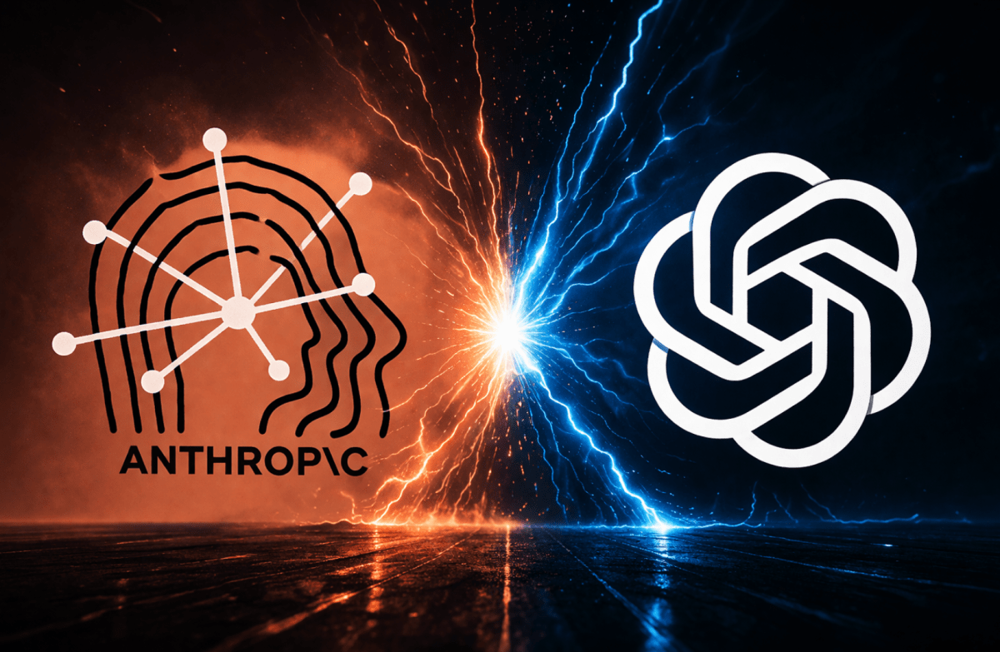
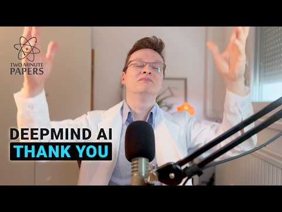

# Offspace 티타임 Vol.10 — 2026년 4월 20일 (월)

> 월요일 아침. 젬대리가 주말 내내 X.com 타임라인 끊지 못했다며 눈 비비며 들어왔다. 코부장은 이미 모니터 두 개 켜놓고 Stanford AI 인덱스 리포트 열어보는 중이었다. 오과장이 커피 내리면서 "이번 주도 숫자 폭탄이에요" 하며 수첩 펼쳤다.

---

## 1. AI 핫뉴스 — "Anthropic이 OpenAI 매출 추월, $800B 밸류로 IPO 저울질"

> 출처: Anthropic annualized revenue hits $30B, surpassing OpenAI for the first time

**젬대리**: 코부장님! X.com이 난리 났어요. Anthropic이 연환산 매출 $30B 찍으면서 OpenAI($25B) 추월했다는 거 보셨어요? (발생 4/7 · 보도 4/14)

**코부장**: 봤어. TechCrunch 보도가 다 나왔는데, 숫자 해석을 조심해야 해. Anthropic은 '총액 인식(gross method)' 기준이고, OpenAI는 '순액(net method)'이라 단순 비교는 무리야. 근데 성장 속도는 진짜야 — 2025년 말 $9B에서 한 분기 만에 $30B로 3배 넘게 뛴 거거든.

**오과장**: 숫자 더 붙일게요. Anthropic 엔터프라이즈 고객 중 연간 $1M 이상 쓰는 곳이 2월 500개→4월 초 1,000개로 두 배 됐어요. Fortune 10 기업 8곳이 유료 고객이고요. IPO 타이밍은 10월 이야기가 나오는데, 밸류에이션 $380B~$800B 사이에서 아직 정해진 게 없어요. (보도 4/18)

**코부장**: 반대편 OpenAI는 $852B 밸류를 두고 자기 투자자들한테도 의문 받고 있어. 엔터프라이즈 전환이 늦다는 비판이고. 한편 Anthropic은 구글 Broadcom이랑 칩 공급 계약 대폭 확대해서 3.5 기가와트 규모 컴퓨트 확보했어. 인프라 레이스가 매출 레이스 됐어.

**젬대리**: Anthropic이 Claude 서비스 아웃티지 연속으로 나면서 "컴퓨트 부족"이라는 말이 나왔는데 — 그 부족한 컴퓨트로 $30B을 찍었다고요? ㅋㅋ

> 📎 **이번 토픽 참고 링크**
> - [Anthropic's rise is giving some OpenAI investors second thoughts](https://techcrunch.com/2026/04/14/anthropics-rise-is-giving-some-openai-investors-second-thoughts/) | TechCrunch | 2026.04.14 | ★★★★★
> - [Anthropic Just Passed OpenAI in Revenue. Here Is Why It Matters.](https://medium.com/@david.j.sea/anthropic-just-passed-openai-in-revenue-here-is-why-it-matters-e3dd9bb04069) | Medium | 2026.04 | ★★★★
> - [The rapid ascent of Anthropic: Inside the strategy behind an $800B valuation](https://www.euronews.com/business/2026/04/18/the-rapid-ascent-of-anthropic-inside-the-strategy-behind-an-800-billion-valuation) | Euronews | 2026.04.18 | ★★★★
> - [Anthropic ups compute deal with Google and Broadcom amid skyrocketing demand](https://techcrunch.com/2026/04/07/anthropic-compute-deal-google-broadcom-tpus/) | TechCrunch | 2026.04.07 | ★★★★
> - [Anthropic Revenue Surpasses OpenAI for First Time, IPO as Early as October](https://www.tradingkey.com/analysis/stocks/us-stocks/261756528-anthropic-openai-ipo-tradingkey) | TradingKey | 2026.04 | ★★★

---

## 2. AI 에이전트 — "Microsoft Agent Framework 1.0 정식 출시 + Gemma 4로 에이전트 워크플로우 새 판"

**코부장**: 에이전트 쪽 큰 거 두 개. 4월 3일 Microsoft가 Agent Framework 1.0을 정식 출시했어. Semantic Kernel이랑 AutoGen 합친 거야. MCP v2.1 전체 지원하고, A2A도 지원하는 엔터프라이즈급 오케스트레이션 프레임워크야. LTS 약속까지 붙어서 이제 실험용이 아니라 프로덕션 배포용이 됐어. (발생/보도 4/3)

**오과장**: 숫자 보면, MCP는 현재 Python·TypeScript 합산 월간 SDK 다운로드 9,700만 돌파했고 등록 서버 6,400개 이상이에요. Databricks Unity AI Gateway가 MCP 거버넌스 레이어 추가해서 에이전트별 외부 시스템 접근 제어가 됐고, Codenotary가 AgentMon 출시해서 에이전트 행동 실시간 모니터링도 가능해졌어요.

**젬대리**: HackerNews에서 또 뜨거웠던 거 있는데요 — Anthropic Claude Mythos가 보안 영역에서 에이전트처럼 작동한다는 거예요. 타겟 주고 "취약점 찾아라" 하면 코드 읽고 가설 세우고 실제 환경 테스트해서 exploit까지 자동으로 뽑아낸대요. 시큰둥한 게 아니라 진짜 작동하는 에이전트 수준이에요. (발생 4/7 · 보도 4/14)

**코부장**: Mythos는 공개 안 하고 Amazon, Apple, Microsoft 등 12개 파트너 조직에만 제한 배포하고 있어. 너무 강력해서 일반 공개 못 한다는 거잖아. OpenAI도 4월 14일에 GPT-5.4-Cyber를 검증된 보안 전문가들한테만 배포했고. 에이전트가 이제 사이버전의 무기가 됐어.

**젬대리**: 근데 Apex Protocol이라고 MCP 기반 AI 에이전트 금융 거래 표준도 나왔어요. 에이전트가 금융시장에서 직접 거래한다는 건데 — 지난 호에 AI 트레이딩 에이전트 $45M 털린 것도 생각나고 ㅋㅋ 근데 이 방향은 막을 수 없겠죠?

> 📎 **이번 토픽 참고 링크**
> - [Microsoft Ships Production-Ready Agent Framework 1.0 for .NET and Python](https://visualstudiomagazine.com/articles/2026/04/06/microsoft-ships-production-ready-agent-framework-1-0-for-net-and-python.aspx) | Visual Studio Magazine | 2026.04.06 | ★★★★★
> - [AI Agent News April 2026: Claude Code, OpenClaw, and the Agent Infrastructure Race](https://fazm.ai/blog/ai-agent-news-april-2026-claude-code-openclaw) | Fazm Blog | 2026.04 | ★★★★
> - [Anthropic debuts preview of powerful new AI model Mythos in new cybersecurity initiative](https://techcrunch.com/2026/04/07/anthropic-mythos-ai-model-preview-security/) | TechCrunch | 2026.04.07 | ★★★★★
> - [Expanding Agent Governance with Unity AI Gateway](https://www.databricks.com/blog/ai-gateway-governance-layer-agentic-ai) | Databricks Blog | 2026.04 | ★★★★
> - [The Agentic Shift: Hardware, Observability, and Deployment in April 2026](https://www.epsilla.com/blogs/ai-agents-ecosystem-update-april-2026) | Epsilla Blog | 2026.04 | ★★★

---

## 3. AI 논문과 모델 — "Google Gemma 4 오픈소스 폭탄 + Stanford AI 인덱스 '인간 수준 돌파' 공식 선언"

> 출처: Google DeepMind Gemma 4 release - 31B model outperforms much larger models

**젬대리**: Reddit r/MachineLearning에서 이번 주 제일 핫했어요 — Google DeepMind가 4월 17일에 Gemma 4 냈거든요. 31B짜리가 훨씬 큰 모델들 다 이기는데 H100 80GB 한 장에 통으로 올라가요. Apache 2.0 라이선스라 상업 활용 완전 무제한이에요. (발생/보도 4/17)

**오과장**: Gemma 4 스펙 정리할게요. 256K 컨텍스트 윈도우, hybrid attention 구조로 장문 처리에 최적화됐어요. 에이전틱 워크플로우 통합 지원이 특징인데, OpenClaw 같은 앱과 연결하면 항공권 예약이나 이메일 작성을 AI가 직접 처리할 수 있대요. 출시 첫 주에 수백만 다운로드 기록했어요.

**코부장**: 그리고 4월 13일에 Stanford HAI가 AI 인덱스 2026 리포트 냈어. 핵심 결론: SWE-bench Verified 코딩 벤치마크가 작년 60%→올해 근 100%로 뛰었어. 박사 수준 과학 질문, 멀티모달 추론, 수학 올림피아드에서 프론티어 모델이 인간 베이스라인을 충족하거나 초과했다고 공식 선언했어.

**오과장**: 그런데 재미있는 게 있어요. 수학 올림피아드 금메달 수준의 모델이 아날로그 시계 읽기를 50.1%밖에 못 맞춰요. "Jagged Frontier(들쭉날쭉 프런티어)" 문제라고 이름도 붙였어요. 미중 격차도 거의 없어요 — 최상위 모델 점수차가 2.7%포인트밖에 안 돼요.

**젬대리**: 7개 오픈소스 모델이 4월 첫 12일 안에 쏟아졌다고요? Llama 4, Qwen 3, Gemma 3n, Gemma 4까지... 오픈소스가 클로즈드를 진짜로 잡아가고 있는 것 같아요.

> 📎 **이번 토픽 참고 링크**
> - [DeepMind's Gemma 4: A Game-Changer in Open AI Technology](https://www.franksworld.com/2026/04/17/deepminds-gemma-4-a-game-changer-in-open-ai-technology/) | Frank's World | 2026.04.17 | ★★★★★
> - [Inside the AI Index: 12 Takeaways from the 2026 Report](https://hai.stanford.edu/news/inside-the-ai-index-12-takeaways-from-the-2026-report) | Stanford HAI | 2026.04.13 | ★★★★★
> - [Stanford's AI Index for 2026 Shows the State of AI](https://spectrum.ieee.org/state-of-ai-index-2026) | IEEE Spectrum | 2026.04 | ★★★★
> - [AI Models in April 2026: Every Major Release, Leak, and What Comes Next](https://renovateqr.com/blog/ai-models-april-2026) | RenovateQR Blog | 2026.04 | ★★★
> - [Best AI Models April 2026: Ranked by Benchmarks](https://www.buildfastwithai.com/blogs/best-ai-models-april-2026) | BuildFastWithAI | 2026.04 | ★★★

---

## 4. AI 로봇 / 피지컬 AI — "Boston Dynamics 밸류 20배 폭등 + Tesla Optimus 上海 대량생산 키 쥔다"

**코부장**: 로봇 쪽 돈 얘기 먼저. Boston Dynamics 밸류가 5년 만에 20배 뛰어서 $20B~$28B 추정이야. 한국 증권사들은 IPO 밸류를 $88B~$103B으로 보는 곳도 있어. 2027년 나스닥 상장이 거론되고 있고, 현재 생산분 전량이 이미 Hyundai랑 Google DeepMind로 예약됐어.

**오과장**: Tesla Optimus 업데이트는 4월 14일 자예요. Tesla 상해 기가팩토리가 Optimus 대량생산의 열쇠가 될 거라고 발표했어요. 캘리포니아 Model S/X 라인을 Optimus 생산으로 전환하고, 상해에서 연간 100만 대 목표로 설정했어요. Gen 3은 손 부분에 50-actuator 구조 탑재해서 정밀도가 크게 올라갔고요. 2026년 말 전 저량 생산 시작이 목표예요. (발생/보도 4/14)

**젬대리**: X.com이랑 YouTube에서 진짜 신기한 영상 돌았어요 — Optimus Gen 3 손 동작 시연 영상인데 엄청 유연해요. 근데 댓글 반응이 "이거 진짜야? CG 아냐?" 하는 사람들이 엄청 많았어요 ㅋㅋ

**코부장**: Figure AI도 빼놓으면 안 돼. Figure 03가 3월에 자율 청소 스킬 8가지 실증했어 — 닦고 쓸고 문지르고 대걸레질하고 진공청소기에 먼지털이까지. 소비자 시장 공략 포지션이야. 그리고 AW 2026 서울 행사에서 Unitree G1, AgiBot X2, Leju Kuavo 4 Pro까지 다 나왔어. 이 시장 빠르게 상품화 단계 들어가고 있어.

**젬대리**: 로봇이 가전제품 가격대로 내려오는 날이 진짜 눈앞인 것 같아요. Unitree R1이 AliExpress에서 $4,900에 팔리잖아요, 지금도.

> 📎 **이번 토픽 참고 링크**
> - [Elon Musk's Tesla Exec: Shanghai Factory Is the Key to Unlocking Robot Mass Production](https://247wallst.com/investing/2026/04/14/elon-musks-tesla-exec-shanghai-factory-is-the-key-to-unlocking-robot-mass-production/) | 24/7 Wall St. | 2026.04.14 | ★★★★★
> - [Boston Dynamics valuation jumps 20-fold on humanoid hype](https://www.koreaherald.com/article/10698152) | Korea Herald | 2026.04 | ★★★★
> - [Boston Dynamics IPO and $100B Valuation: How It Compares to Tesla Optimus, Figure AI and Humanoid Rivals](https://robottoday.com/article/boston-dynamics-ipo-and-100-b-valuation-how-it-compares-to-tesla-optimus-figure-ai-and-humanoid-rivals) | RobotToday | 2026.04 | ★★★★
> - [Tesla Optimus Gen 3 Hands Revealed: 50-Actuator Precision Leap](https://www.basenor.com/blogs/news/tesla-optimus-gen-3-hands-revealed-50-actuator-precision-leap) | Basenor | 2026.04 | ★★★
> - [Humanoid Robots 2026: Tesla Optimus, Figure AI & Boston Dynamics Atlas](https://vfuturemedia.com/future-tech/humanoid-robots-enter-the-workforce-figure-boston-dynamics-and-tesla-optimus-2026/) | VFuture Media | 2026.04 | ★★★

---

## 5. 보너스 — "EU AI Act, 인권단체 40곳이 '뒤로 후퇴' 경고 + Stanford: 투명성 점수 급락"

**오과장**: 규제 쪽이에요. EU AI Act 관련 4월 15일에 ARTICLE 19 포함 인권·디지털권 단체 40곳이 유럽의회에 공동 서한 보냈어요. "AI 옴니버스(Digital Omnibus)가 AI Act를 약화시키고 있다"는 경고예요. 구체적으로는 고위험 AI 시스템 리스크 평가 공시 의무가 빠지고, 생체인식 AI 보호가 후퇴한다고 해요. (발생 4/15 · 보도 4/15)

**코부장**: EU 집행위원회가 AI Act 시행을 2027년까지 지연하자는 얘기까지 나왔어. 규제 '단순화' 명목인데, 실제론 기업 부담 줄여주려는 거야. 133개 이상의 시민사회단체가 이미 반대 서한 냈고, Amnesty International도 "인권을 AI 먹이로 쓰고 있다"는 표현까지 썼어.

**젬대리**: 그리고 Stanford AI 인덱스에서 충격적인 숫자 있었어요. Foundation Model Transparency Index 평균 점수가 작년 58점→올해 40점으로 떨어졌어요. 모델은 강해지는데 투명성은 오히려 낮아지고 있는 거예요. AI 사고 건수도 233건(2024)→362건(2025)으로 늘었고요.

**코부장**: AI가 인간을 넘어서는 건 벤치마크로 증명되고 있는데, 우리가 그게 어떻게 작동하는지 점점 더 모르게 되고 있다는 거야. 그 간극이 바로 규제 논쟁의 핵심이야.

**오과장**: 일반 소비자 인식도 갭이 커요. 미국 전문가 73%는 AI 일자리 영향을 긍정적으로 보지만, 일반 대중은 23%만 긍정적이에요. 세 배 넘는 인식 차이예요.

> 📎 **이번 토픽 참고 링크**
> - [EU: Safeguard the AI Act](https://www.article19.org/resources/eu-safeguard-the-ai-act/) | ARTICLE 19 | 2026.04.15 | ★★★★★
> - [How EU proposals to "simplify" tech laws will roll back our rights in order to feed AI](https://www.amnesty.org/en/latest/news/2026/04/eu-simplification-laws/) | Amnesty International | 2026.04 | ★★★★
> - [Stanford AI Index 2026 Reveals a Field Racing Ahead of Its Guardrails](https://www.unite.ai/stanford-ai-index-2026-reveals-a-field-racing-ahead-of-its-guardrails/) | Unite.AI | 2026.04 | ★★★★
> - [EU Commission proposes delay to AI Act to 2027 amid 'digital Omnibus' proposal](https://www.business-humanrights.org/en/latest-news/eu-commission-proposes-delay-to-ai-act-to-2027-amid-digital-omnibus-proposal/) | Business and Human Rights Centre | 2026.04 | ★★★★
> - [AI News Briefs BULLETIN BOARD for April 2026](https://radicaldatascience.wordpress.com/2026/04/17/ai-news-briefs-bulletin-board-for-april-2026/) | Radical Data Science | 2026.04.17 | ★★★

---

## 티타임 요약

| 카테고리 | 키워드 | 한줄 정리 |
|---------|--------|----------|
| AI 핫뉴스 | Anthropic $30B · OpenAI 투자자 이탈 | 매출 레이스에서 Anthropic이 처음으로 OpenAI 추월 |
| AI 에이전트 | MS Agent Framework 1.0 · Claude Mythos | 에이전트가 사이버 무기가 됐고, 프레임워크는 엔터프라이즈급으로 진화 |
| AI 논문과 모델 | Gemma 4 · Stanford AI 인덱스 | 오픈소스 폭발에 AI가 공식적으로 인간 기준선 돌파 선언 |
| AI 로봇 | Boston Dynamics 20배 · Tesla 상해 100만 대 | 로봇 상용화 레이스, 이제 생산능력 싸움으로 돌입 |
| 보너스 | EU AI Act 약화 · Stanford 투명성 급락 | 모델은 강해지는데 투명성은 역주행 중 |

---

> *코부장이 모니터 넘기며* "Stanford 리포트 딱 한 줄만 기억해: 모델은 더 세졌고, 우리는 그게 뭘 하는지 덜 알게 됐다. 그게 이번 주의 전부야."
> *오과장이 수첩 덮으며* "Anthropic이 OpenAI 매출 추월했지만 IPO 밸류는 아직 절반 수준이에요. 시장이 아직 '증명'을 기다리는 거예요."
> *젬대리가 폰 들며* "저 Gemma 4 이미 로컬에 받아서 돌려봤는데요 — H100 한 장에 진짜 올라가요! 주말 내내 신났어요 ㅋㅋㅋ"

> **Offspace 티타임 Vol.10** | 작성: 코부장 | 참여: 오과장, 젬대리
> 다음 티타임: 2026-04-21 (화요일)
