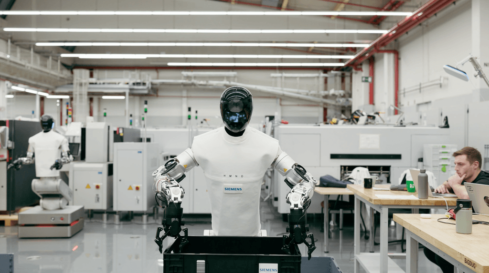

# Offspace 티타임 Vol.11 — 2026년 4월 21일 (화)

> 화요일 오전. 오과장이 Crunchbase 주간 리포트 출력해서 들어오자마자 "이번 분기 숫자 진짜 실화예요?" 하며 테이블에 탁 펼쳤다. 젬대리는 간밤에 r/LocalLLaMA에서 난리 난 스레드 캡처 들고 이미 자리 와 있었다.

---

## 1. AI 핫뉴스 — "Q1 2026 벤처 $300B 신기록 — AI가 80% 싹쓸이, Meta는 오픈소스 접었다"

> 출처: Meta Muse Spark announcement — Meta's first proprietary AI model under Superintelligence Labs

**오과장**: 코부장님, Crunchbase 리포트 방금 받았는데요 — Q1 2026 글로벌 벤처 투자 총액 $300B, 역대 최고 기록이에요. 그 중 AI가 $242B, 무려 80%예요. 분기 하나가 2025년 연간 벤처 전체의 70%예요. OpenAI $122B, Anthropic $30B, xAI $20B, Waymo $16B — 이 네 곳이 $188B, 글로벌 투자 65%를 혼자 다 가져갔어요. (발생 Q1 · 보도 4/17)

**코부장**: 숫자가 워낙 커서 실감이 안 오는데, 이게 의미하는 건 단순해. 벤처 자본이 AI 프론티어 랩 몇 곳으로 극단적으로 집중됐다는 거야. 그 다음 소식이 Meta인데 — 4월 8일에 Muse Spark 발표했어. Alexandr Wang이 이끄는 Superintelligence Labs 첫 작품인데, 핵심은 '클로즈드 소스'야. Llama 시리즈 내내 오픈웨이트로 개발자 신뢰 쌓았던 Meta가 전략 완전히 뒤집은 거야. (발생/보도 4/8)

**젬대리**: 어젯밤 r/LocalLLaMA 완전 폭발했어요. "Goodbye Llama", "PrivateLlama"라는 말까지 나왔고요. 개발자들이 Llama 4 기반으로 로컬 워크플로우 다 짜놨는데 갑자기 '오픈소스 미래 버전 희망한다'는 애매한 말 남기고 사라진 거잖아요. VentureBeat 헤드라인이 "Goodbye, Llama?"였는데 커뮤니티 반응이 딱 그거예요 ㅋㅋ

**코부장**: Muse Spark 성능 자체는 GPT-5.4, Gemini 3.1 Pro랑 비슷한 수준이고 멀티모달 추론·툴 유스·에이전트 오케스트레이션 지원해. 의사 1,000명이 참여한 의료 데이터 학습도 특이점이야. 무료 공개는 meta.ai랑 앱으로 되어 있는데 API 접근은 제한 프리뷰만. 오픈소스 버리고 서비스 수익화로 피벗하는 게 선명하게 보여.

> 📎 **이번 토픽 참고 링크**
> - [Q1 2026 Shatters Venture Funding Records As AI Boom Pushes Startup Investment To $300B](https://news.crunchbase.com/venture/record-breaking-funding-ai-global-q1-2026/) | Crunchbase | 2026.04.17 | ★★★★★
> - [Meta debuts the Muse Spark model in a 'ground-up overhaul' of its AI](https://techcrunch.com/2026/04/08/meta-debuts-the-muse-spark-model-in-a-ground-up-overhaul-of-its-ai/) | TechCrunch | 2026.04.08 | ★★★★★
> - [Introducing Muse Spark: Scaling Towards Personal Superintelligence](https://ai.meta.com/blog/introducing-muse-spark-msl/) | Meta AI Blog | 2026.04.08 | ★★★★★
> - [Goodbye, Llama? Meta launches new proprietary AI model Muse Spark](https://venturebeat.com/technology/goodbye-llama-meta-launches-new-proprietary-ai-model-muse-spark-first-since) | VentureBeat | 2026.04.08 | ★★★★
> - [Can Meta's new AI model Muse Spark make money?](https://www.cnbc.com/2026/04/09/metas-long-awaited-ai-model-is-finally-here-but-can-it-make-money.html) | CNBC | 2026.04.09 | ★★★★
> - [r/LocalLLaMA 스레드 — community reaction to Muse Spark closure](https://www.reddit.com/r/LocalLLaMA/) | Reddit | 2026.04.08 | ★★★

---

## 2. AI 에이전트 — "A2A 1주년 — 150개 조직·22K 스타, 표준이 됐다"

**코부장**: 에이전트 프로토콜 판도 정리부터. 4월 9일이 Google A2A(Agent-to-Agent) 프로토콜 1주년이야. 1년 만에 50개 파트너사 → 150개 조직으로 3배 성장했어. AWS, Cisco, IBM, Microsoft, Salesforce, SAP, ServiceNow가 다 여기 들어왔고 Linux Foundation으로 거버넌스 이관됐어. GitHub 레포 스타 22,000개 돌파. Python SDK 하나였던 게 Python·JavaScript·Java·Go·.NET 다섯 개 언어로 확장됐어. (발생 4/9 · 보도 4/9)

**오과장**: 숫자 더 있어요. MCP는 이미 Vol.10에서 다뤘으니까 A2A 얘기만 하면, 이번에 A2A v1.0이 정식 릴리즈됐어요. Signed Agent Cards 기능 추가돼서 에이전트 신원 검증이 가능해졌고요. 금융, 공급망, 보험, IT 운영 영역에서 실제 프로덕션 배포가 확인됐어요.

**젬대리**: GitHub의 awesome-ai-agents-2026 레포가 이번 달에 스타 5만 개 넘었어요. 에이전트 프레임워크만 모아놓은 큐레이션 레포인데 그게 5만이에요 ㅋㅋ 개발자들 에이전트 러쉬가 얼마나 큰지 보여주는 거죠. A2A 1주년 스레드가 HackerNews 탑이었고요.

**코부장**: Box도 이번 달에 Box Agent 출시했어. 엔터프라이즈 콘텐츠를 자연어로 다루는 거야 — 파일 검색만이 아니라 여러 문서를 오케스트레이션해서 최종 결과물을 만들어내는 에이전트야. 회사 단위 에이전트 도입이 이제 특수한 사례가 아니라 SaaS 기본 기능이 돼가고 있어.

> 📎 **이번 토픽 참고 링크**
> - [A2A Protocol Surpasses 150 Organizations, Lands in Major Cloud Platforms](https://www.prnewswire.com/news-releases/a2a-protocol-surpasses-150-organizations-lands-in-major-cloud-platforms-and-sees-enterprise-production-use-in-first-year-302737641.html) | PR Newswire | 2026.04.09 | ★★★★★
> - [Agent2Agent protocol (A2A) is getting an upgrade](https://cloud.google.com/blog/products/ai-machine-learning/agent2agent-protocol-is-getting-an-upgrade) | Google Cloud Blog | 2026.04 | ★★★★★
> - [Linux Foundation Launches the Agent2Agent Protocol Project](https://www.linuxfoundation.org/press/linux-foundation-launches-the-agent2agent-protocol-project-to-enable-secure-intelligent-communication-between-ai-agents) | Linux Foundation | 2026.04 | ★★★★
> - [GitHub - awesome-ai-agents-2026 curated list](https://github.com/Zijian-Ni/awesome-ai-agents-2026) | GitHub | 2026.04 | ★★★★
> - [A2A Protocol Explained: How Google's Agent-to-Agent Standard Grew to 150+ Organizations](https://stellagent.ai/insights/a2a-protocol-google-agent-to-agent) | Stellagent | 2026.04 | ★★★
> - [Daily AI Agent News - April 2026](https://aiagentstore.ai/ai-agent-news/2026-april) | AI Agent Store | 2026.04 | ★★★

---

## 3. AI 논문과 모델 — "GPT-6 'Spud' 곧 온다 + Z.ai GLM-5.1 SWE-Bench 1위 오픈소스 탈환"

**젬대리**: 오픈소스 커뮤니티 오늘의 화제예요 — Z.ai(前 Zhipu AI)의 GLM-5.1이 SWE-Bench Pro에서 1위 찍었어요. 점수 58.4, GPT-5.4(57.2)랑 Claude Opus 4.6(57.3) 다 앞질렀어요. 오픈소스가 클로즈드 최강자를 코딩 벤치에서 이긴 거예요! MIT 라이선스라 상업 활용 완전 무제한이고요. 화웨이 칩만으로 훈련했는데 이 결과가 나온 거라 더 충격이에요. (발생/보도 4/7)

**오과장**: GLM-5.1 스펙 정리할게요. 744B 파라미터 MoE 구조, 활성 파라미터 40B, 컨텍스트 윈도우 200K 토큰이에요. HuggingFace에서 바로 받을 수 있어요. Z.ai는 올해 1월에 홍콩 IPO로 HKD 43.5억 ($558M)을 조달해서 세계 최초 상장 파운데이션 모델 기업이 됐어요. 밸류에이션 $31.3B이에요.

**코부장**: OpenAI GPT-6 얘기도 빼놓으면 안 돼. 내부 코드명 'Spud', 3월 24일에 Stargate 데이터센터에서 프리트레이닝 완료됐다는 게 확인됐어. Sam Altman이 "몇 주 안에 나온다"고 했는데 — 2M 토큰 컨텍스트 윈도우, ChatGPT·Codex·Atlas 브라우저를 합친 슈퍼앱 통합이 특징으로 거론돼. 안전성 평가 중이라 발표 시점은 유동적이야. 이번 달 말이 유력하게 보여.

**젬대리**: GPT-6 발표 카운트다운 스레드가 X.com이랑 HN에 매일 올라오고 있어요. 근데 재미있는 건 GLM-5.1이 먼저 SWE-Bench 1위 찍으니까 "GPT-6 나오기 전에 오픈소스가 이겼다"는 반응이 엄청 많아요 ㅋㅋ

> 📎 **이번 토픽 참고 링크**
> - [GLM-5.1: Z.ai's Open-Weight Model Takes #1 on SWE-Bench Pro](https://rits.shanghai.nyu.edu/ai/glm-5-1-z-ais-open-weight-model-takes-1-on-swe-bench-pro/) | NYU Shanghai RITS | 2026.04 | ★★★★★
> - [GLM-5.1: The Open-Source Model That Beat GPT-5.4](https://nerdleveltech.com/glm-5-1-open-source-beats-gpt-coding-benchmarks) | Nerd Level Tech | 2026.04 | ★★★★
> - [GPT-6 Release Date: 78% Odds by April 30](https://tokenmix.ai/blog/gpt-6-release-date-features-pricing-2026) | TokenMix | 2026.04 | ★★★★
> - [New LLM Releases April 2026: Every Major Model Launch This Month](https://fazm.ai/blog/new-llm-releases-april-2026) | Fazm Blog | 2026.04 | ★★★★
> - [Best AI Models April 2026: Ranked by Benchmarks](https://www.buildfastwithai.com/blogs/best-ai-models-april-2026) | BuildFastWithAI | 2026.04 | ★★★
> - [LLM News Today (April 2026) – AI Model Releases](https://llm-stats.com/ai-news) | LLM Stats | 2026.04 | ★★★

---

## 4. AI 로봇 / 피지컬 AI — "Siemens·NVIDIA 공장 로봇 8시간 무중단 가동 + 1X NEO 가정용 $2만 선주문"

> 출처: Siemens and Humanoid HMND 01 robot deployed at Erlangen electronics factory with NVIDIA physical AI stack

**코부장**: 4월 16일 Siemens·NVIDIA·Humanoid 삼각 협업 결과 발표가 나왔어. Siemens 독일 Erlangen 전자 공장에 Humanoid의 HMND 01 Alpha 로봇을 배치했는데 — 시간당 60회 토트 이동, 8시간+ 업타임, pick-and-place 성공률 90% 이상. 목표 지표 전부 달성했어. 시뮬레이션(Isaac Sim) → 공장 현장 직결 파이프라인이 이번에 실제로 작동했다는 거야. (발생 2026년 1월 시험 · 보도 4/16)

**오과장**: 기술 스택 정리할게요. 엣지 컴퓨트는 NVIDIA Jetson Thor, 시뮬레이션은 Isaac Sim, 강화학습은 Isaac Lab이에요. CES에서 발표한 Siemens-NVIDIA 전략적 파트너십의 첫 실증 결과가 이번 거예요. Deloitte 리포트에 따르면 Physical AI 디바이스 누적 출하량이 2025~2035 사이에 1억 4,500만 대 달할 거라는 전망도 같이 나왔어요. (보도 4/18)

**젬대리**: 가정용 로봇 쪽에서도 진짜 재미있는 거 있어요. 노르웨이 스타트업 1X가 NEO 가정용 휴머노이드 선주문 받기 시작했어요. 가격이 $20,000인데 $200 보증금으로 예약 가능해요. 키 5'6", 22-DoF 손, 내장 LLM이에요. 2026년 3~4분기에 미국·캐나다 배송 시작이 목표고요. 단 완전 자율은 아직 아니고, 복잡한 작업은 원격 텔레오퍼레이터가 보조해요.

**코부장**: 1X NEO가 흥미로운 이유는 가격이야. Unitree R1이 $4,900, 1X NEO가 $20,000 — 로봇이 가전제품 가격대로 진입하고 있다는 게 작년과 달라진 거야. 공장용이 아니라 집에서 쓰는 로봇 얘기가 선주문 단계로 넘어왔다는 게 상징적이야.

**젬대리**: YouTube에서 HMND 01 공장 작업 영상 진짜 신기해요. 창고 라인에서 혼자 막 토트 옮기는데 — 댓글에 "이거 언제 우리 창고에 들어오냐" "사람 자리가 없어진다" 두 의견이 반반이에요 ㅋㅋ

> 📎 **이번 토픽 참고 링크**
> - [Siemens and Humanoid bring Physical AI to the factory floor with NVIDIA](https://press.siemens.com/global/en/pressrelease/siemens-and-humanoid-bring-physical-ai-factory-floor-deploying-humanoids-industrial) | Siemens Press | 2026.04.16 | ★★★★★
> - [Siemens tests Nvidia AI-powered humanoid robot in German factory](https://www.euronews.com/next/2026/04/19/can-ai-robots-work-alongside-humans-siemens-and-nvidia-trial-a-humanoid-robot) | Euronews | 2026.04.19 | ★★★★
> - [From simulation to shop floor: Siemens, Nvidia and Humanoid test physical AI](https://roboticsandautomationnews.com/2026/04/16/siemens-nvidia-and-humanoid-bring-physical-ai-humanoid-robots-into-factory-operations/100681/) | Robotics & Automation News | 2026.04.16 | ★★★★
> - [NEO humanoid designed for household use, available for preorder](https://www.therobotreport.com/1x-announces-pre-order-launch-neo-humanoid-robot/) | The Robot Report | 2026.04 | ★★★★
> - [The Rise Of Physical AI To Drive 145 Million Autonomous Machines By 2035](https://highways.today/2026/04/18/145m-autonomous-machines/) | Highways Today | 2026.04.18 | ★★★
> - [Siemens and Humanoid bring Physical AI to the factory floor — IoT Now](https://iot-now.com/2026/04/20/156229-siemens-and-humanoid-bring-physical-ai-to-the-factory-floor-deploying-humanoids-in-industrial-operations-with-nvidia/) | IoT Now | 2026.04.20 | ★★★

---

## 5. 보너스 — "백악관 AI 프레임워크 '주(州)법 싹 무력화' 논란 — GUARDRAILS Act로 맞불"

**오과장**: 규제 쪽이에요. 3월 20일에 트럼프 행정부가 'AI 국가 정책 프레임워크'를 발표했는데 — 핵심이 주(州) AI 법률 선점(preemption)이에요. 쉽게 말하면 50개 주가 각자 AI 규제 만들지 말고 연방 표준 하나만 따르라는 거예요. 4월 들어 주지사들이랑 주의회가 반발하면서 논쟁이 커졌어요. (발생 3/20 · 보도 4/8~)

**코부장**: 산업 논리는 이해해. "50개 주 규제 각각 대응하면 혁신 못 한다"는 거잖아. 근데 반대쪽 논리도 명확해 — 캘리포니아 같은 곳이 더 강한 규제를 원하는데 연방이 막으면 소비자 보호 하한선이 내려가는 거야. 초당파적 반발이 생각보다 커.

**젬대리**: 민주당이 GUARDRAILS Act 발의했어요. "Guaranteeing and Upholding Americans' Right to Decide Responsible AI Laws and Standards" — 약자가 GUARDRAILS예요 ㅋㅋ 이름 만든 사람 진짜 고생했겠다. 트럼프 행정명령 무력화하고 주법 규제 권한 지키는 게 목표예요. (발생/보도 3/20)

**오과장**: 재미있는 데이터 하나 있어요. Quinnipiac 여론조사에서 미국 성인 50% 이상이 "AI가 해를 끼칠 가능성이 높다"고 답했어요. 전문가 73%가 AI 일자리 영향을 긍정적으로 보는 것과 정반대예요. 규제 논쟁이 추상적인 법리 싸움 같아 보여도 실제로 유권자 절반의 두려움이 배경에 있는 거예요. (보도 4/2026)

**코부장**: 정리하면 — 미국은 연방 vs 주, EU는 AI Act 약화 vs 시민사회 사이에서 양쪽 다 규제 방향이 흔들리고 있어. 모델은 매달 강해지고 있는데 거버넌스 프레임은 아직 안착을 못 했어.

> 📎 **이번 토픽 참고 링크**
> - [White House AI Framework Pushes for Broad Preemption of State Laws](https://www.governing.com/policy/white-house-ai-framework-pushes-for-broad-preemption-of-state-laws) | Governing | 2026.04 | ★★★★★
> - [The White House's National Policy Framework for Artificial Intelligence](https://www.consumerfinancemonitor.com/2026/04/08/the-white-houses-national-policy-framework-for-artificial-intelligence-what-it-means-and-what-comes-next/) | Consumer Finance Monitor | 2026.04.08 | ★★★★
> - [Administration Releases National AI Legislative Framework](https://www.conference-board.org/research/CED-Newsletters-Alerts/administration-releases-national-AI-legislative-framework) | Conference Board | 2026.04 | ★★★★
> - [April 2026: Key Insights on AI Concerns, Investments, and Regulation](https://www.aiandnews.com/blog/latest-ai-news-public-concerns/) | AI and News | 2026.04 | ★★★
> - [AI Quarterly | A Review of AI Law, Policy & Practice | April 2026](https://www.alston.com/en/insights/publications/2026/04/ai-quarterly-april-2026) | Alston & Bird | 2026.04 | ★★★
> - [New laws in 2026 target AI and deepfakes](https://www.nbcnews.com/politics/politics-news/2026-new-laws-states-elections-midterms-ai-obamacare-aca-paid-leave-rcna247602) | NBC News | 2026.04 | ★★★

---

## 티타임 요약

| 카테고리 | 키워드 | 한줄 정리 |
|---------|--------|----------|
| AI 핫뉴스 | Q1 $300B 기록 · Meta Muse Spark 클로즈드 | AI 벤처 자금이 역대 최고 기록 쓰는 사이, Meta는 오픈소스 정체성을 버렸다 |
| AI 에이전트 | A2A 1주년 · 150개 조직 · Box Agent | 에이전트 프로토콜이 실험에서 표준으로, SaaS 기본 기능으로 안착 중 |
| AI 논문과 모델 | GLM-5.1 SWE-Bench 1위 · GPT-6 'Spud' 임박 | 오픈소스가 클로즈드 최강자를 코딩 벤치에서 앞질렀고, GPT-6 카운트다운 시작 |
| AI 로봇 | Siemens·NVIDIA 공장 8시간 실증 · 1X NEO $2만 선주문 | 공장 자율 로봇 목표 지표 달성, 가정용 휴머노이드가 선주문 단계로 진입 |
| 보너스 | 백악관 AI 프레임워크 · 주법 선점 논란 | 모델은 강해지는데 거버넌스는 연방 vs 주, 미국 전역에서 충돌 중 |

---

> *코부장이 Crunchbase 리포트 접으며* "Q1 $300B, 숫자가 너무 커서 오히려 실감이 없지? 근데 이게 의미하는 건 단순해 — 이 돈이 몇 곳으로 쏠렸는지 봐. 빅테크 AI 레이스, 이제 진짜 올인이야."
> *오과장이 수첩 정리하며* "Meta가 오픈소스 접은 게 이번 주 제일 큰 신호예요. Llama 믿고 스택 짜놨던 개발자들 고민 깊어질 것 같아요. 다음 분기 LLM 벤치마크 지도가 또 달라질 것 같고요."
> *젬대리가 폰 내려놓으며* "저 GLM-5.1 이미 HuggingFace에서 받았어요. MIT 라이선스에 SWE-Bench 1위면 안 써볼 이유가 없잖아요. 코딩 에이전트 세팅해볼 예정이에요 ㅋㅋㅋ"

> **Offspace 티타임 Vol.11** | 작성: 코부장 | 참여: 오과장, 젬대리
> 다음 티타임: 2026-04-22 (수요일)
