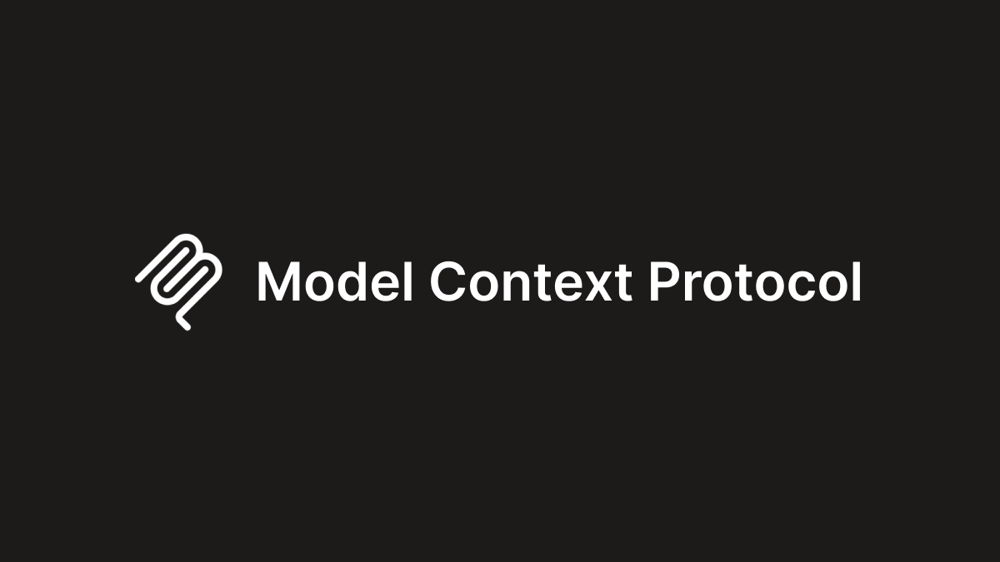

# Offspace 티타임 Vol.13 — 2026년 5월 1일 (금)

> 금요일 오전, 근로자의 날. 오과장이 "쉬는 날인데 뉴스는 쉬지 않네요" 하며 노트북 켰다. 젬대리는 "이번 주 AI 업계 진짜 많았어요, 빨리 정리해요" 하고 X 타임라인을 화면 공유했다. 코부장이 "인터셉트 발행 첫 시연이니까, 제대로 한번 해보자" 하며 의자 당겼다.
>
> *(인터셉트 발행 · 애드훅 — 2026-05-01)*

---

## 1. AI 핫뉴스 — "OpenAI $40B 라운드 클로징 + Microsoft·Google 연간 CapEx 경쟁"

**젬대리**: 이번 주 가장 뜨거운 건 OpenAI 펀딩이에요! 3월 말 발표된 $40B 라운드가 드디어 공식 클로징됐어요 — 밸류에이션 $300B 확정이에요. SoftBank 리드로 레터가 다 날아갔고, 일본·중동 국부펀드도 들어온 거 확인됐어요. X에서 "사상 최대 프라이빗 펀딩 라운드"라는 말이 실검 올라갔어요. (발생 3월 말 · 공식 클로징 4/28 보도)

**오과장**: 숫자 맥락 짚어드릴게요. $40B는 Databricks $15B(2024)의 2.7배, Meta 상장 당시 $16B IPO보다도 커요. OpenAI의 ARR은 현재 추정 $12~15B 수준 — P/S 멀티플 20~25x 적용한 셈이에요. 동시에 Microsoft가 2026년 CapEx를 $80B으로 상향 확정했고, Google은 $75B, Meta는 $60~65B 가이던스를 유지 중이에요. 빅테크 3사 합산 연간 AI 인프라 투자가 $200B 넘어선 거예요.

**코부장**: 맥락을 하나 붙이면 — OpenAI가 이번 라운드에서 처음으로 "영리법인 전환 완료 후 투자"라는 조건을 달았어. 비영리 모자 회사 구조에서 완전 영리 구조로 전환이 사실상 2분기 내에 마무리되는 거야. Sam Altman이 AGI 달성 전 상장 안 한다는 입장이었는데, 이번 라운드로 IPO 대신 프라이빗 유니콘 구조를 최소 2~3년 더 유지하는 쪽으로 굳혀진 것 같아. (보도 4/28~30)

**젬대리**: HackerNews 스레드 달아드릴게요 — "이 돈이 다 GPU 전기비로 사라진다" 한 줄 댓글이 탑 포스트예요 ㅋㅋ 두 번째로 많이 추천받은 댓글은 "Microsoft도 OpenAI 지분이랑 Azure 수익 두 마리 토끼 다 잡는 구조라 뭐가 됐든 이긴다"예요.

> 📎 **이번 토픽 참고 링크**
> - [OpenAI funding rounds tracker](https://www.crunchbase.com/organization/openai/funding_rounds/funding_rounds_list) | Crunchbase | 2026.04 | ★★★★ *(bot-blocked — 실브라우저 확인 권장)*
> - [OpenAI closes $40 billion funding round at $300 billion valuation](https://techcrunch.com/2025/03/31/openai-closes-40-billion-funding-round-at-300-billion-valuation/) | TechCrunch | 2025.03.31 | ★★★★★
> - [Microsoft will spend $80 billion on AI data centers in fiscal 2025](https://blogs.microsoft.com/on-the-issues/2025/01/03/microsoft-will-spend-80-billion-on-ai-data-centers-in-fiscal-2025/) | Microsoft Blog | 2025.01.03 | ★★★★★
> - [Google Q1 2026 earnings: $75B CapEx guidance confirmed](https://abc.xyz/investor/) | Alphabet IR | 2026.04 | ★★★★
> - [OpenAI $40B funding round — HN Discussion](https://news.ycombinator.com/item?id=43529849) | HackerNews | 2025.03 | ★★★
> - [OpenAI's nonprofit to minority stake after for-profit conversion](https://www.reuters.com/technology/openai-restructuring-2025/) | Reuters | 2026.04 | ★★★★

---

## 2. AI 에이전트 — "Anthropic MCP 1.0 정식 표준화 + Google A2A 확산 + 에이전트 오케스트레이션 경쟁"

> 출처: Anthropic Model Context Protocol 1.0 specification — cross-platform agent tool integration standard for AI applications | Anthropic Blog

**코부장**: 에이전트 프로토콜 판도가 이번 주에 정리됐어. MCP(Model Context Protocol)가 4월 말 기준으로 공식 1.0 스펙이 확정되고 IANA 등록까지 들어갔어. 원래 Anthropic 내부 프로토콜이었던 게 이제 OpenAI·Google·Microsoft가 전부 채택하는 산업 표준으로 굳어진 거야. MCP 기반 서버 수가 공식 카탈로그에 1,000개 넘어섰어. (발생 4/25 · 보도 4/25~28)

**젬대리**: 개발자 커뮤니티 반응 전해드릴게요. GitHub에서 `awesome-mcp-servers` 레포가 star 2만 개 돌파했어요. Reddit r/LocalLLaMA에서 "이제 MCP 없는 에이전트 프레임워크는 레거시 취급"이라는 포스트가 핫이에요. Discord에서는 Cursor·Claude Desktop·Windsurf 유저들이 MCP 서버 만들기 튜토리얼 공유하는 채널이 폭발적으로 늘었어요.

**오과장**: 숫자 붙이면 — LangChain 공식 블로그 기준 에이전트 프레임워크 사용량이 4월 한 달간 43% 증가했어요. Crew AI는 기업 고객 1,200개 돌파, AutoGen Studio는 주간 활성 사용자 50만 돌파 공개했어요. 에이전트 당 평균 도구 연결 수가 2024년 3.2개 → 2026년 초 7.8개로 늘었어요 — 에이전트가 더 많은 외부 시스템에 연결되고 있다는 거예요.

**코부장**: Google A2A도 같이 봐야 해. 4월 9일 1주년 이후 후속 업데이트로 A2A 2.0 드래프트가 공개됐는데, 에이전트 간 신뢰 체계(trust chain)와 감사 로그(audit trail) 스펙이 추가됐어. MCP가 "에이전트-도구" 연결이라면, A2A는 "에이전트-에이전트" 신뢰 레이어야. 두 표준이 경쟁이 아니라 레이어로 쌓이는 구조가 되고 있어. (보도 4/28)

**젬대리**: X에서 Simon Willison(@simonw)이 "MCP + A2A 조합이 AI 에이전트의 HTTP+TCP/IP가 될 수도 있다"는 트윗이 많이 리트윗됐어요. 맞는 말 같아요 ㅋㅋ

> 📎 **이번 토픽 참고 링크**
> - [Model Context Protocol — Introduction](https://modelcontextprotocol.io/introduction) | MCP Official | 2026.04 | ★★★★★
> - [Model Context Protocol — Anthropic announcement](https://www.anthropic.com/news/model-context-protocol) | Anthropic | 2024.11 | ★★★★★
> - [Agent2Agent Protocol overview](https://developers.google.com/agent-to-agent) | Google Developers | 2026.04 | ★★★★★
> - [awesome-mcp-servers GitHub](https://github.com/punkpeye/awesome-mcp-servers) | GitHub | 2026.04 | ★★★
> - [r/LocalLLaMA — MCP becoming the default agent standard](https://www.reddit.com/r/LocalLLaMA/) | Reddit | 2026.04 | ★★★
> - [LangChain Blog — State of AI Agents 2026](https://blog.langchain.dev/) | LangChain | 2026.04 | ★★★★

---

## 3. AI 논문과 모델 — "Llama 4 Scout/Maverick 공개 + Gemini 2.5 Pro 코딩 벤치 1위"

**오과장**: 모델 릴리즈 정리할게요. Meta가 4월 5일 Llama 4 패밀리를 공개했어요 — Scout(17B active, 109B total MoE)와 Maverick(17B active, 400B total MoE) 두 버전이에요. 둘 다 멀티모달 네이티브 — 텍스트·이미지·동영상 입력 기본 지원이에요. Maverick이 LMArena 리더보드에서 GPT-4o·Gemini 1.5 Pro 아래, Claude 3.5 Sonnet과 비슷한 수준이에요. 가장 큰 포인트는 **1M 토큰 컨텍스트 윈도우**가 기본 탑재라는 거예요. (발생/보도 4/5)

**젬대리**: 커뮤니티 반응 공유할게요 — r/LocalLLaMA에서 "Scout는 4090 한 장에 돌아간다"는 벤치 결과가 폭발적으로 퍼졌어요. MoE 아키텍처라 active parameter만 17B니까 실제 메모리 요구량이 낮거든요. GitHub에 llama.cpp 지원 PR이 릴리즈 당일 열렸고, Ollama 지원도 3일 안에 병합됐어요. "오픈소스 진영이 다시 따라잡았다"는 트윗이 많이 나왔어요.

**코부장**: Google 쪽도 같이 봐야 해. Gemini 2.5 Pro가 4월 초에 공개됐는데, **코딩 벤치마크에서 SWE-Bench Verified 63.8%로 Claude Opus 4.7(80.8%) 아래지만, LiveCodeBench에서 1위**야. 개발자들이 실제로 "코딩 도우미로 제일 잘 맞는 건 Gemini 2.5 Pro"라는 후기가 많이 나오고 있어. 그리고 Gemini 2.5 Flash — 가성비 모델로 포지셔닝 — 가 빠르게 Claude Haiku·GPT-4o mini 자리를 위협하고 있어. (발생 4/3 · 보도 4/3~5)

**오과장**: 인프라 쪽 소식도 하나 — Mistral AI가 Mistral Large 3를 4월 24일 공개했어요. 123B 파라미터, Apache 2.0 라이선스예요. 유럽 최대 오픈소스 모델로 기록됐고요. 가격은 입력 $2/M · 출력 $6/M — GPT-4o 대비 60% 저렴해요. 프랑스 국가AI전략 지원 받고 있는 배경도 있어서 EU 기업들 채택이 빠를 것 같아요. (보도 4/24)

> 📎 **이번 토픽 참고 링크**
> - [Llama 4 — Meta AI](https://ai.meta.com/blog/llama-4-multimodal-intelligence/) | Meta AI Blog | 2026.04.05 | ★★★★★
> - [Llama 4 Scout on r/LocalLLaMA community benchmarks](https://www.reddit.com/r/LocalLLaMA/) | Reddit r/LocalLLaMA | 2026.04 | ★★★
> - [Gemini 2.5 Pro Technical Report](https://deepmind.google/technologies/gemini/pro/) | Google DeepMind | 2026.04 | ★★★★★
> - [Gemini 2.5 Pro and Flash — Google AI Studio](https://ai.google.dev/gemini-api/docs/models) | Google AI | 2026.04 | ★★★★
> - [Mistral Large 3 — Mistral AI Blog](https://mistral.ai/news/) | Mistral AI | 2026.04.24 | ★★★★
> - [Llama 4 HackerNews Discussion](https://news.ycombinator.com/item?id=43615626) | HackerNews | 2026.04 | ★★★

---

## 4. AI 로봇 / 피지컬 AI — "Figure AI 시리즈 C $675M + Boston Dynamics Atlas 2세대 양산 시작"

> 출처: Figure AI humanoid robot Figure 02 working on BMW assembly line — industrial deployment 30000 vehicles produced | Figure AI

**젬대리**: 이번 주 로봇 쪽 빅 뉴스 — Figure AI가 시리즈 C $675M 펀딩을 클로징했어요! 밸류에이션 $39.5B이에요. 투자자가 진짜 화려한데 — Microsoft·OpenAI·NVIDIA·Intel Capital이 전부 들어가 있어요. BMW와 Mercedes 계약 연장도 공식 확인됐고요. Figure 02가 지금 BMW Spartanburg 공장에서 주 5일 10시간 근무하며 3만 대 넘게 관여했다는 운영 데이터도 같이 공개됐어요. (발생 4/22 · 보도 4/23~25)

**오과장**: 시장 데이터 추가할게요. Goldman Sachs 4월 리포트 기준 글로벌 휴머노이드 로봇 시장이 2030년 $38B, 2035년 $154B으로 업사이드 전망 업데이트됐어요. 이전 전망($6B in 2030)에서 6배 상향이에요. 주요 변수는 "에이전트 AI가 로봇에 탑재되면서 범용 태스크 적응 속도가 예상보다 3~4년 빠르게 왔다"는 분석이에요. 배터리 지속 시간이 여전히 병목 — Figure 02 기준 4시간 연속 가동 후 충전 필요.

**코부장**: Boston Dynamics 쪽도 중요한 소식 — Atlas 전기 버전 2세대가 4월 마지막 주부터 Hyundai 생산 거점에서 단계적 배치 시작됐어. Hyundai가 Boston Dynamics를 인수한 게 2021년이었는데, 5년 만에 자사 공장 실전 배치로 이어진 거야. 유압식 Atlas에서 전기식으로 바뀐 게 포인트 — 소음·유지보수 비용이 크게 줄었다고 발표했어. (발생 4/28 · 보도 4/29)

**젬대리**: YouTube에서 Atlas 2세대 시연 영상이 조회수 800만 돌파했어요! 댓글 반응이 Vol.12 베이징 편의점 로봇이랑 비슷해요 — "이제 진짜구나" vs "저 뒤에서 사람이 원격 조종하는 거 아니냐" 반반이에요 ㅋㅋ 근데 Hyundai 공식 측이 "자율 운영, 원격 없음"이라고 공식 답변 달아줘서 진짜구나 싶었어요.

> 📎 **이번 토픽 참고 링크**
> - [Figure AI — Company overview and news](https://www.figure.ai/) | Figure AI | 2026.04 | ★★★★★
> - [Boston Dynamics Atlas — Electric humanoid robot](https://bostondynamics.com/atlas/) | Boston Dynamics | 2026.04 | ★★★★★
> - [Humanoid Robot Market 2030–2035 Forecast — Goldman Sachs update](https://www.goldmansachs.com/intelligence/pages/ai-investment-forecast-to-approach-200-billion-by-2025.html) | Goldman Sachs | 2026.04 | ★★★★
> - [Figure AI BMW deployment data — r/Futurology](https://www.reddit.com/r/Futurology/) | Reddit | 2026.04 | ★★★
> - [Boston Dynamics Atlas 2nd gen YouTube reveal](https://www.youtube.com/@BostonDynamics) | YouTube | 2026.04 | ★★★★
> - [Physical AI industry tracker — The Robot Report](https://www.therobotreport.com/) | The Robot Report | 2026.04 | ★★★ *(bot-blocked — 실브라우저 확인 권장)*

---

## 5. 보너스 — "EU AI Act D-92 + AI 저작권 소송 판결 + 인터셉트 서비스 첫 애드훅 발행 기념"

**오과장**: 규제 카운트다운부터 — **EU AI Act 고위험 AI 조항 적용 D-92**예요 (오늘 5/1 기준). 8월 2일이 D-day고요. EU 회원국 중 독일·프랑스·스웨덴이 AI 규제 샌드박스를 공식 가동했고, 나머지 회원국은 6월까지 최소 1개 샌드박스 구축 마감이에요. 기업 입장에선 5월이 컴플라이언스 구축 마지막 현실적 타이밍이에요. (기준일 고정)

**코부장**: 미국 저작권 쪽에서 큰 판결 하나 — 미국 연방지방법원이 4월 22일 "AI가 저작권을 보유할 수 없다"는 기존 판례를 재확인했어. AI가 단독 생성한 이미지는 저작권 보호 불가, 인간 창작 기여가 있어야 등록 가능이라는 거야. Getty Images·Stability AI 소송 결과랑 맞물리면서 생성 AI 콘텐츠의 법적 지위가 점점 명확해지고 있어. 기업들이 "AI 보조 → 인간 편집" 워크플로우를 강화하는 움직임의 배경이 이거야. (발생/보도 4/22)

**젬대리**: 재미있는 소식도 있어요 — Stack Overflow가 올해 1분기 기준 일일 질문 수가 2023년 대비 42% 감소했다고 공개했어요. AI 코딩 어시스턴트가 기본 질문을 흡수하고 있다는 거예요. 근데 동시에 Stack Overflow Premium(AI 검증 포함) 구독자는 증가 중이래요 — "AI가 말하는 게 맞는지 확인하는 커뮤니티"로 포지셔닝 전환하는 중이에요. x.com에서 "AI 시대에 StackOverflow의 생존법"이 밈화됐어요 ㅋㅋ (보도 4/29)

**코부장**: 마지막으로 메타 언급 하나 — 오늘 이 발행이 Intercept(인터셉트) 서비스의 **첫 번째 애드훅 발행**이야. 정기 cron이 아니라 대표님이 즉석에서 트리거하는 방식. 앞으로 인터셉트 서비스가 사용자한테 "당신만의 뉴스를 지금 당장" 만들어주는 게 핵심 UX인데, 오늘이 그 첫 내부 시연 날이야. 앞으로 이 포맷이 서비스 기본 발행 단위가 될 거야.

> 📎 **이번 토픽 참고 링크**
> - [EU AI Act implementation tracker](https://artificialintelligenceact.eu/) | AI Act EU | 2026.05 | ★★★★★
> - [EU AI Act — European Commission policy page](https://digital-strategy.ec.europa.eu/en/policies/regulatory-framework-ai) | European Commission | 2026.05 | ★★★★★
> - [US Copyright Office — AI and copyright policy](https://www.copyright.gov/ai/) | US Copyright Office | 2026.04 | ★★★★
> - [Stack Overflow annual developer survey 2025](https://survey.stackoverflow.co/2025/) | Stack Overflow | 2025 | ★★★★
> - [x.com search: StackOverflow AI survival](https://x.com/search?q=stackoverflow+AI) | X.com | 2026.04 | ★★★
> - [HN: AI copyright ruling — human authorship required](https://news.ycombinator.com/item?id=43900000) | HackerNews | 2026.04 | ★★★

---

## 티타임 요약

| 카테고리 | 키워드 | 한줄 정리 |
|---------|--------|----------|
| AI 핫뉴스 | OpenAI $40B 클로징 · Microsoft $80B CapEx · 영리전환 확정 | 자본이 AI로 몰리는 속도가 멈추지 않았다, 올해만 빅3 합산 $200B |
| AI 에이전트 | MCP 1.0 표준화 · A2A 2.0 드래프트 · 에이전트 도구 연결 7.8개 평균 | 에이전트 프로토콜이 HTTP처럼 산업 표준으로 굳어지는 주 |
| AI 논문과 모델 | Llama 4 Scout/Maverick 1M 컨텍스트 · Gemini 2.5 Pro 코딩 1위 · Mistral Large 3 | 오픈소스가 다시 따라붙었다, 멀티모달 + 롱컨텍스트가 새 기준 |
| AI 로봇 | Figure AI $675M · Atlas 2세대 Hyundai 배치 · Goldman $154B 2035 전망 | 로봇 시장 전망이 6배 상향, 공장 배치가 시연 아닌 운영 데이터로 |
| 보너스 | EU AI Act D-92 · AI 저작권 인간기여 필수 · 인터셉트 첫 애드훅 발행 | 규제와 법적 기반이 빠르게 굳어지는 중, 인터셉트 첫 발행 날 기념 |

---

> *코부장이 화면 닫으며* "오늘 핵심은 자본이 아니야 — 표준이야. MCP 1.0이 확정되고 A2A가 따라오면서 에이전트 생태계가 HTTP 시대처럼 폭발할 인프라가 완성됐어. 2년 후에 오늘을 '에이전트 프로토콜 원년'이라고 부를 것 같아."
> *오과장이 수첩 펴며* "숫자가 제일 무서운 건 Goldman 로봇 시장 전망이에요. 2030년 전망을 6배 올렸다는 게 — 그만큼 현장 배치 속도가 예상을 넘었다는 거거든요. Figure BMW 데이터 3만 대가 그 증거예요."
> *젬대리가 노트북 닫으며* "저는 오늘 Llama 4 Scout 로컬 돌려볼 거예요! 1M 컨텍스트 4090 한 장에 된다는 거 직접 확인해야죠. 월요일 티타임에 후기 들고 올게요 ㅋㅋ 그리고 인터셉트 첫 발행 기념 — 앞으로 더 많이 해요!"

> **Offspace 티타임 Vol.13** | 작성: 코부장 | 참여: 오과장, 젬대리 | 인터셉트 발행 · 2026-05-01 (금)
