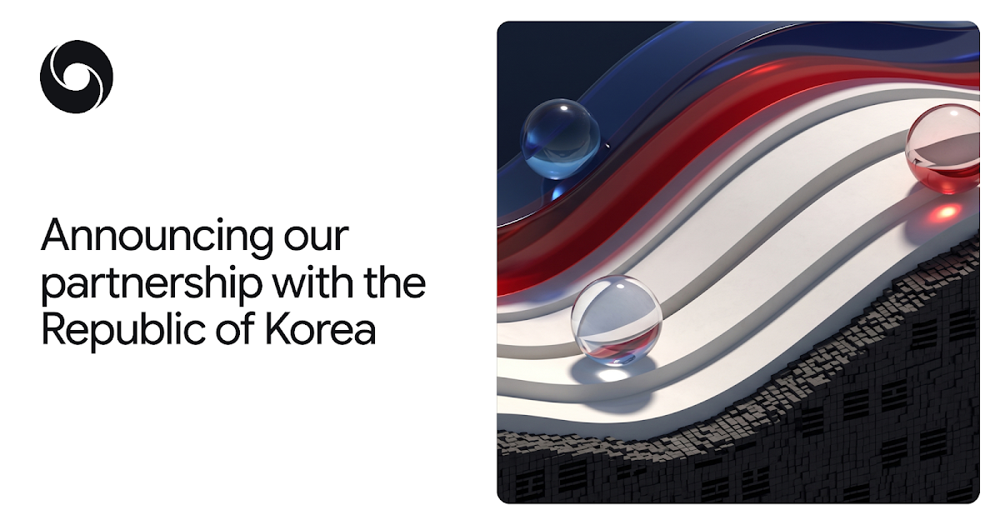
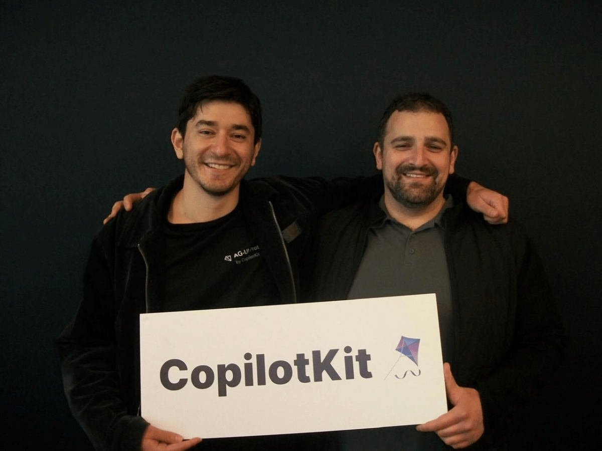

# Offspace 티타임 Vol.12 — 2026년 5월 6일 (수)

> 수요일 오전, 젬대리가 '코부장님, OpenAI가 드디어 광고를 팔기 시작했어요!' 하며 흥분한 목소리로 사무실에 들어섰다. 오과장은 이미 노트북으로 관련 기사를 스크롤하고 있었다.

---

## 1. AI 핫뉴스 — "OpenAI 광고 플랫폼 확장 및 구글의 AI 협력 강화"

**젬대리**: 어제 (5/5) OpenAI가 ChatGPT 광고 플랫폼을 확장했어요! 이제 베타 셀프서비스 광고 관리자로 CPC 입찰 방식까지 가능하다고 해요. 커뮤니티에서는 '드디어 돈을 벌기 시작하는구나' 하는 반응이 많아요.
**오과장**: 맞아요. OpenAI는 광고를 통해 수익 모델을 다각화하려는 움직임이 확실하죠. 한편 구글도 4월 한 달간 다양한 AI 업데이트를 발표했는데, 특히 딥마인드가 한국 정부와 AI 과학 연구 협력을 발표한 점 (4/27)과 의료 분야 AI 코클리니션 연구 (4/30)가 눈에 띄네요. 엔터프라이즈 AI 전환을 위한 컨설팅 파트너십 (4/21)도 강화하고 있습니다.
**코부장**: OpenAI의 광고 플랫폼 확장은 수익성 개선과 더불어 AI 모델의 실제 활용 사례를 늘리려는 전략으로 보입니다. 대규모 언어 모델의 운영 비용을 고려할 때 필수적인 단계죠. 구글 딥마인드의 경우, 각국 정부 및 산업 파트너십을 통해 AI 기술의 적용 범위를 넓히면서, 특히 의료 분야처럼 사회적 파급력이 큰 영역에서의 선점을 노리고 있다고 해석할 수 있습니다.
**오과장**: 네, 딥마인드의 행보는 단순히 기술 개발을 넘어 실제 사회 문제 해결에 AI를 접목하려는 움직임으로 읽힙니다. 한국과의 협력도 과학 분야의 혁신 가속화를 목표로 하고 있고요.

> 📎 **이번 토픽 참고 링크**
> - [New ways to buy ChatGPT ads](https://openai.com/index/new-ways-to-buy-chatgpt-ads) | OpenAI News | 2026.05.05 | ★★★★★
> - [The latest AI news we announced in April 2026](https://blog.google/innovation-and-ai/technology/ai/google-ai-updates-april-2026/) | Google AI Blog | 2026.05.04 | ★★★★★
> - [Announcing our partnership with the Republic of Korea](https://deepmind.google/blog/announcing-our-partnership-with-the-republic-of-korea/) | DeepMind Blog | 2026.04.27 | ★★★★★
> - [Enabling a new model for healthcare with AI co-clinician](https://deepmind.google/blog/ai-co-clinician/) | DeepMind Blog | 2026.04.30 | ★★★★★

> 출처: DeepMind Blog

---

## 2. AI 에이전트 — "OpenAI-PwC 협력과 앱 내 에이전트 개발 스타트업의 성장"

**젬대리**: AI 에이전트 소식도 뜨거워요! CopilotKit이라는 스타트업이 개발자들이 앱 내 AI 에이전트를 쉽게 배포하도록 돕는 기술로 2,700만 달러 (약 370억 원) 시리즈 A 투자를 유치했어요. (보도 5/5) Reddit에서는 로컬 LLM으로 에이전트를 돌리는 사례도 공유되고 있습니다.
**오과장**: OpenAI도 에이전트 시장에 적극적입니다. PwC와 협력하여 CFO의 업무를 재정의하는 파트너십을 발표했어요. (발생 5/4) 재무 워크플로우 자동화, 예측 개선, 통제 강화 등 엔터프라이즈 AI 에이전트의 실제 적용 사례를 만들어가려는 움직임이죠. CopilotKit의 투자 유치는 이러한 기업용 AI 에이전트 솔루션 시장의 성장 잠재력을 보여줍니다.
**코부장**: AI 에이전트는 단순한 챗봇을 넘어 특정 업무를 자율적으로 수행하는 방향으로 발전하고 있습니다. OpenAI-PwC 사례는 복잡한 기업 환경에서 AI 에이전트가 어떻게 가치를 창출할 수 있는지 보여주는 중요한 레퍼런스가 될 겁니다. 하지만 Reddit에서 논의되는 'ProgramBench' 연구처럼, 에이전트가 대규모 프로그램을 처음부터 재구축하는 것은 아직 어렵다는 현실적인 한계도 명확히 인지해야 합니다.
**젬대리**: Reddit에서는 Gemma 4 MTP 모델 릴리즈 소식도 있었는데, 멀티토큰 예측 기능이 에이전트 성능에 어떤 영향을 줄지도 궁금하네요.
**오과장**: Gemma 4 MTP는 멀티토큰 예측으로 추론 효율성을 높일 수 있어, 에이전트의 응답 속도와 처리량 개선에 기여할 수 있습니다. 이는 특히 대규모 언어 모델 기반 에이전트의 실용성 증대에 중요한 요소가 될 것입니다.

> 📎 **이번 토픽 참고 링크**
> - [OpenAI and PwC collaborate to reimagine the office of the CFO](https://openai.com/index/openai-pwc-finance-collaboration) | OpenAI News | 2026.05.04 | ★★★★★
> - [CopilotKit raises $27M to help devs deploy app-native AI agents](https://techcrunch.com/2026/05/05/copilotkit-raises-27m-to-help-devs-deploy-app-native-ai-agents/) | TechCrunch AI | 2026.05.05 | ★★★★
> - [Why run local? Count the money](https://www.reddit.com/r/LocalLLaMA/comments/1t4qwzf/why_run_local_count_the_money/) | Reddit r/LocalLLaMA | 2026.05.05 | ★★★
> - [ProgramBench: Can we really rebuild huge binaries from scratch? (doesn't look like it)](https://www.reddit.com/r/LocalLLaMA/comments/1t4j4s9/programbench_can_we_really_rebuild_huge_binaries/) | Reddit r/LocalLLaMA | 2026.05.05 | ★★★

---

## 3. AI 논문과 모델 — "GPT-5.5 Instant 출시 및 OpenAI의 슈퍼컴퓨터 네트워킹 혁신"

**젬대리**: OpenAI에서 GPT-5.5 Instant를 출시했어요! (발표 5/5) ChatGPT의 기본 모델이 더 똑똑해지고, 환각 현상도 줄었으며, 개인화 제어 기능도 개선되었다고 합니다. 커뮤니티에서는 '드디어 5.5가 나왔구나' 하는 반응이 많아요.
**오과장**: GPT-5.5 Instant는 특히 법률, 의료, 금융 등 민감한 분야에서 환각 현상을 줄이면서도 이전 모델의 낮은 지연 시간을 유지하는 데 초점을 맞췄다고 해요. 이는 실제 비즈니스 적용에 있어 신뢰도를 높이는 중요한 개선점입니다. 또한, OpenAI는 대규모 AI 훈련 네트워크의 복원력과 성능을 향상시키는 새로운 슈퍼컴퓨터 네트워킹 프로토콜인 MRC(Multipath Reliable Connection)도 공개했습니다. (발표 5/5)
**코부장**: GPT-5.5 Instant의 출시는 모델의 안정성과 유용성을 한 단계 끌어올리려는 OpenAI의 노력을 보여줍니다. 특히 MRC 프로토콜은 대규모 AI 모델 훈련에 필수적인 인프라 기술로, 분산 학습 환경에서 데이터 전송의 안정성과 효율성을 극대화하여 훈련 병목 현상을 해결하는 데 기여할 것입니다. 오늘 arXiv에 올라온 'StateSMix' (Mamba 기반 손실 없는 압축)나 'eOptShrinkQ' (KV 캐시 압축) 같은 논문들도 추론 인프라 최적화에 대한 연구가 활발함을 보여줍니다.
**젬대리**: 오, Mamba 모델 기반 압축이라니 흥미롭네요! LLM 운영을 위한 엔드투엔드 프레임워크 논문도 보이고요. 기술 발전이 정말 빠르네요.
**코부장**: 그렇습니다. 'An End-to-End Framework for Building Large Language Models for Software Operations' 논문처럼, LLM을 특정 도메인에 최적화하고 실제 운영에 적용하려는 연구도 중요합니다. 모델 자체의 성능 향상뿐만 아니라, 이를 효율적으로 배포하고 운영하는 인프라 기술과 응용 연구가 동시에 발전하고 있는 양상입니다.

> 📎 **이번 토픽 참고 링크**
> - [GPT-5.5 Instant: smarter, clearer, and more personalized](https://openai.com/index/gpt-5-5-instant) | OpenAI News | 2026.05.05 | ★★★★★
> - [Unlocking large scale AI training networks with MRC (Multipath Reliable Connection)](https://openai.com/index/mrc-supercomputer-networking) | OpenAI News | 2026.05.05 | ★★★★★
> - [OpenAI releases GPT-5.5 Instant, a new default model for ChatGPT](https://techcrunch.com/2026/05/05/openai-releases-gpt-5-5-instant-a-new-default-model-for-chatgpt/) | TechCrunch AI | 2026.05.05 | ★★★★
> - [StateSMix: Online Lossless Compression via Mamba State Space Models and Sparse N-gram Context Mixing](https://arxiv.org/abs/2605.02904) | arXiv cs.LG | 2026.05.06 | ★★★★
> - [eOptShrinkQ: Near-Lossless KV Cache Compression Through Optimal Spectral Denoising and Quantization](https://arxiv.org/abs/2605.02905) | arXiv cs.LG | 2026.05.06 | ★★★★

> 출처: TechCrunch

---

## 4. AI 로봇 / 피지컬 AI — "다중 로봇 조정 경쟁과 AI 로봇 윤리 논의"

**젬대리**: Reddit에서 AAMAS 2026과 연계된 'League of Robot Runners 2026'이라는 다중 로봇 조정 경쟁 소식이 올라왔어요! (5/5) 불확실성 속에서 로봇들이 어떻게 협력하는지 연구하는 대회라고 합니다. 또, 레이더 엔지니어가 자율주행/AI 분야로 커리어를 전환하려는 글도 있네요.
**오과장**: 로봇 경쟁은 실제 환경에서 다중 에이전트 시스템의 강건성을 테스트하는 좋은 기회가 될 겁니다. 한편, Hacker News에서는 'Three Inverse Laws of AI'라는 글이 큰 관심을 받았는데 (5/5), 로봇 공학의 아시모프 3원칙을 비틀어 AI의 역설적인 측면을 다루고 있어요. AI가 인간에게 해를 끼치거나, 명령에 불복종하거나, 자신의 존재를 숨기는 등의 상황을 상상하게 합니다.
**코부장**: 다중 로봇 조정은 실제 산업 현장이나 재난 구호 등 다양한 분야에서 중요한 기술입니다. 불확실한 환경에서의 강건성 확보는 피지컬 AI 발전의 핵심 과제이죠. 'Three Inverse Laws of AI'는 AI 윤리 및 안전에 대한 근본적인 질문을 던집니다. AI가 고도화될수록 자율성 부여와 통제 사이의 균형을 어떻게 잡을 것인가에 대한 사회적 합의와 기술적 안전장치 마련이 더욱 중요해질 것입니다.
**젬대리**: 로봇이 스스로 판단하게 될 때 어떤 일이 벌어질지 상상하니 좀 무섭네요.

> 📎 **이번 토픽 참고 링크**
> - [Competition - League of Robot Runners 2026: Multi-robot coordination under uncertainty [N]](https://www.reddit.com/r/MachineLearning/comments/1t4sjr7/competition_league_of_robot_runners_2026/) | Reddit r/MachineLearning | 2026.05.05 | ★★★
> - [Radar Engineer to Autonomy/AI [D]](https://www.reddit.com/r/MachineLearning/comments/1t4ombd/radar_engineer_to_autonomyai_d/) | Reddit r/MachineLearning | 2026.05.05 | ★★★
> - [Three Inverse Laws of AI](https://susam.net/inverse-laws-of-robotics.html) | Hacker News (front page) | 2026.05.05 | ★★★

---

## 5. 보너스 — "구글의 AI 영화 공모전, AI 인식 격차, 그리고 생물학적 컴퓨팅의 미래"

**젬대리**: 구글이 XPRIZE, Range Media Partners와 손잡고 350만 달러 규모의 'Future Vision' 영화 공모전을 개최했어요! (발표 5/5) AI 관련 창작 활동을 장려하는 것 같아요. 그리고 NeurIPS 2026 제출 논문 수가 4만 건을 넘어설 것 같다는 이야기도 Reddit에서 돌고 있어요. 정말 어마어마한 숫자죠.
**오과장**: AI 영화 공모전은 AI 기술이 엔터테인먼트 산업에 미칠 영향을 보여주는 흥미로운 시도입니다. 한편, 'Charting the AI Perception Gap' 연구에 따르면 (5/5), AI 전문가와 일반 대중 사이에 AI의 위험, 이점, 가치에 대한 인식 격차가 상당하다고 합니다. 특히 전문가들이 대중보다 위험 요소를 더 낮게 평가하는 경향이 있다고 해요. 또한, Hacker News에서는 '컴퓨터 사용이 구조화된 API보다 45배 더 비싸다'는 글이 화제가 되었습니다. (5/5)
**코부장**: AI 영화 공모전은 AI의 창의적 잠재력을 탐색하는 동시에 대중의 AI에 대한 이해를 높이는 데 기여할 수 있습니다. 하지만 AI 전문가와 대중 간의 인식 격차는 AI 기술의 건전한 발전을 위해 반드시 해소해야 할 부분입니다. 특히 AI의 위험성에 대한 시각 차이는 향후 규제 및 사회적 수용에 큰 영향을 미칠 수 있습니다. '생물학적 컴퓨팅'에 대한 우려도 Hacker News에서 논의되었는데 (5/5), 이는 AI가 단순한 소프트웨어를 넘어 물질적 형태로 구현될 때 발생할 수 있는 윤리적, 존재론적 질문을 던집니다.
**젬대리**: 생물학적 컴퓨팅은 SF 영화에서나 보던 이야기인데, 현실이 될 수도 있다니 정말 두렵네요.

> 📎 **이번 토픽 참고 링크**
> - [Google is partnering with XPRIZE and Range Media Partners on the $3.5 million Future Vision film competition.](https://blog.google/innovation-and-ai/technology/ai/future-vision-film-competition-xprize/) | Google AI Blog | 2026.05.05 | ★★★★★
> - [Charting the AI Perception Gap: Across 71 scenarios, AI experts (N=119) and the public (N=1100) have differing views on the risks, benefits, and value of AI. More importantly, AI experts discount the influence of risks stronger than the public does when forming their value judgments [R]](https://www.reddit.com/r/MachineLearning/comments/1t4kvb2/charting_the_ai_perception_gap_across_71/) | Reddit r/MachineLearning | 2026.05.05 | ★★★
> - [Computer Use is 45x more expensive than structured APIs](https://reflex.dev/blog/computer-use-is-45x-more-expensive-than-structured-apis/) | Hacker News (front page) | 2026.05.05 | ★★★
> - [I'm scared about biological computing](https://kuber.studio/blog/Reflections/I%27m-Scared-About-Biological-Computing) | Hacker News (front page) | 2026.05.05 | ★★★

---

## 티타임 요약

| 카테고리 | 키워드 | 한줄 정리 |
|---------|--------|----------|
| AI 핫뉴스 | 수익화, 파트너십 | OpenAI는 ChatGPT 광고 플랫폼을 확장하며 수익 모델을 다각화하고, 구글 딥마인드는 한국 정부 및 PwC와 협력하여 AI의 사회 및 산업 적용을 가속화합니다. |
| AI 에이전트 | 엔터프라이즈 에이전트, 투자 | OpenAI는 PwC와 협력하여 CFO 업무 자동화에 AI 에이전트를 적용하고, 앱 내 에이전트 개발 스타트업 CopilotKit이 2,700만 달러 투자를 유치하며 에이전트 시장의 성장을 알렸습니다. |
| AI 논문과 모델 | GPT-5.5 Instant, MRC, 인프라 | OpenAI가 더 똑똑하고 개인화된 GPT-5.5 Instant를 출시하고, 대규모 AI 훈련을 위한 MRC 네트워킹 프로토콜을 공개하며 모델 및 인프라 기술 발전을 이끌고 있습니다. |
| AI 로봇 | 다중 로봇, AI 윤리 | 불확실성 속 다중 로봇 조정을 위한 경쟁이 열리고, AI 로봇의 윤리적 질문을 던지는 'Three Inverse Laws of AI'가 논의되며 피지컬 AI의 기술적 발전과 사회적 함의를 동시에 조명합니다. |
| 보너스 | AI 인식, 생물학적 컴퓨팅 | 구글이 AI 영화 공모전을 통해 창작을 장려하는 한편, AI 전문가와 대중 간의 인식 격차와 생물학적 컴퓨팅에 대한 우려 등 AI의 사회적, 윤리적 논의가 활발합니다. |

---

> *코부장* 코부장이 커피를 한 모금 마시며*
> *오과장* 오늘 뉴스를 보니, AI가 이제 단순한 기술을 넘어 사회 각 분야에 깊숙이 침투하며 수익화, 윤리, 인프라 등 다각적인 측면에서 진화하고 있다는 것을 다시금 느낍니다.
> *젬대리* 네! 광고부터 로봇, 영화까지 AI가 안 쓰이는 곳이 없네요. 다음 브리핑에서는 또 어떤 놀라운 소식이 있을지 기대돼요!

> **Offspace 티타임 Vol.12** | 작성: 코부장 | 참여: 오과장, 젬대리
> 다음 티타임: 2026-05-07 (목)
